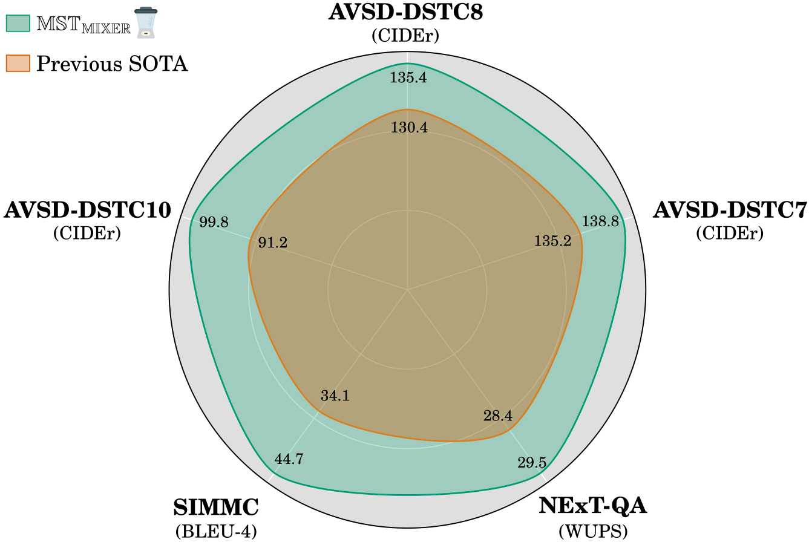

<div align="center">
<h1> MST-MIXER : Multi-Modal Video Dialog State Tracking in the Wild </h1>
    
**[Adnen Abdessaied][16], &nbsp; [Lei Shi][17], &nbsp; [Andreas Bulling][18]**  <br> <br>
**ECCV 2024, Milan, Italy ** <br>
**[[Paper][19]]**

---------------------------
<br><br>

</div>

# Citation 
If you find our code useful or use it in your own projects, please cite our paper:

```bibtex
@InProceedings{Abdessaied_2024_eccv,
    author    = {Abdessaied, Adnen and Shi, Lei and Bulling, Andreas},
    title     = {{Multi-Modal Video Dialog State Tracking in the Wild}},
    booktitle = {Proceedings of the European Conference on Computer Vision (ECCV)},
    year      = {2024}
    }
```

# Table of Contents
* [Setup and Dependencies](#Setup-and-Dependencies)
* [Download Data](#Download-Data)
* [Training](#Training)
* [Response Generation](#Response-Generation)
* [Results](#Results)
* [Acknowledgements](#Acknowledgements)

# Setup and Dependencies
We implemented our model using Python 3.7 and PyTorch 1.12.0 (CUDA 11.3, CuDNN 8.3.2). We recommend to setup a virtual environment using Anaconda. <br>
1. Install [git lfs][1] on your system
2. Clone our repository to download a checpint of our best model and our code
   ```shell
       git lfs install
       git clone this_repo.git
   ```
3. Create a conda environment and install dependencies
   ```shell
       conda create -n mst_mixer python=3.7
       conda activate mst_mixer
       conda install pytorch==1.12.0 torchvision==0.13.0 torchaudio==0.12.0 cudatoolkit=11.3 -c pytorch
       conda install pyg -c pyg
       conda install pytorch-scatter -c pyg  # pytorch >= 1.8.0
       conda install pytorch-sparse -c pyg  # pytorch >= 1.8.0
       conda install -c huggingface transformers
       pip install evaluate wandb glog pyhocon attrs
    ```
# Download Data
## AVSD
1. Download the [AVSD-DSTC7][2], [AVSD-DSTC8][3] and [AVSD-DSTC10][10] data
2. Place the raw json files in ```raw_data/``` and the features in ```features/```
3. Prepeocess and save the input features for faster training as indicated in ```custom_datasets/```
## NExT-QA
1. For convenience, we included the features/data in this git repo.

# Training
We trained our model on 8 Nvidia Tesla V100-32GB GPUs. The default hyperparameters in ```config/mst_mixer.conf``` need to be adjusted if your setup differs from ours.
## AVSD
1. Set ```task=avsd``` in ```config/mst_mixer.conf```
2. ```shell
   CUDA_VISIBLE_DEVICES=0,1,2,3,4,5,6,7 python main.py \
   --mode train \ 
   --tag mst_mixer_avsd \
   --wandb_mode online \
   --wandb_project mst_mixer_avsd
   ```
To deactivate [wandb][4] logging, use ```--wandb_mode disabled```.
On a similar setup to ours, this will take roughly 20h to complete.

## NExT-QA
1. Set ```task=nextqa``` in ```config/mst_mixer.conf```
2. ```shell
   CUDA_VISIBLE_DEVICES=0,1,2,3,4,5,6,7 python main.py \
   --mode train \ 
   --tag mst_mixer_nextqa \
   --wandb_mode online \
   --wandb_project mst_mixer_nextqa
   ```

# Response Generation
## AVSD-DSTC7
1. Set ```dstc=7``` in the ```.conf``` file of your trained networks. in The default setting, can find this under ```logs/unique_training_tag/code/config/mst_mixer.conf``` 
2. Generate the responses
```shell
./generate_parallel_avsd.sh mst_mixer/mixer results_avsd_dstc7 generate logs/mst_mixer_avsd 7
```
3. All responses will be saved in ```output/dstc7/```
## AVSD-DSTC8
1. Set ```dstc=8``` in the ```.conf``` file of your trained networks. in The default setting, can find this under ```logs/unique_training_tag/code/config/mst_mixer.conf``` 
2. Generate the responses
```shell
./generate_parallel_avsd.sh mst_mixer/mixer results_avsd_dstc8 generate logs/mst_mixer_avsd 8
```
3. All responses will be saved in ```output/dstc8/```

## AVSD-DSTC10
1. Set ```dstc=10``` in the ```.conf``` file of your trained networks. in The default setting, can find this under ```logs/unique_training_tag/code/config/mst_mixer.conf``` 
2. Generate the responses
```shell
./generate_parallel_avsd.sh mst_mixer/mixer results_avsd_dstc10 generate logs/mst_mixer_avsd 10
```
3. All responses will be saved in ```output/dstc10/```

## NExT-QA
1. Generate the responses
```shell
./generate_parallel_nextqa.sh mst_mixer/mixer results_nextqa generate logs/mst_mixer_nextqa
```
2. All responses will be saved in ```output/nextqa/```
3. Evalute using this [script][15] 


# Results
To evaluate our best model on 
## AVSD-DSTC7
Executing the [eval_tool][7] of AVSD-DSTC7 using the generated repsonses will output the following metrics
| Model    | BLUE-1 | BLUE-2 | BLUE-3 | BLUE-4 | METEOR | ROUGE-L | CIDEr |
|:--------:|:------:|:------:|:------:|:------:|:------:|:-------:|:-----:| 
| Prev. SOTA | 78.2 | 65.5 | 55.2 | 46.9 | 30.8 | 61.9 | 135.2 | 
| MST_MIXER | **78.7** | **66.5** | **56.3** | **47.6** | **31.3** | **62.5** | **138.8**| 

## AVSD-DSTC8
1. Set ```dstc=8``` in the ```ckpt/code/mst_mixer.conf```
2. run
```shell
./generate_parallel_avsd.sh mst_mixer/mixer results_avsd_dstc8_best_model generate ckpt/avsd 8
```
3. The responses will be saved in ```output/dstc8/```
4. Executing the [eval_tool][7] of AVSD-DSTC8 using the generated repsonses will output the following metrics

| Model    | BLUE-1 | BLUE-2 | BLUE-3 | BLUE-4 | METEOR | ROUGE-L | CIDEr |
|:--------:|:------:|:------:|:------:|:------:|:------:|:-------:|:-----:| 
| Prev. SOTA | 76.4 | 64.1 | 54.3 | 46.0 | 30.1 | 61.0 | 130.4 | 
| MST_MIXER | **77.5** | **66.0** | **56.1** | **47.7** | **30.6** | **62.4** | **135.4**|

## AVSD-DSTC10
Executing the [eval_tool][11] of AVSD-DSTC10 using the generated repsonses will output the following metrics

| Model    | BLUE-1 | BLUE-2 | BLUE-3 | BLUE-4 | METEOR | ROUGE-L | CIDEr |
|:--------:|:------:|:------:|:------:|:------:|:------:|:-------:|:-----:| 
| Prev. SOTA | 69.3 | 55.6 | 45.0 | 37.2 | 24.9 | 53.6 | 91.2 | 
| MST_MIXER | **70.0** | **57.4** | **47.6** | **40.0** | **25.7** | **54.5** | **99.8**|

## NExT-QA
Executing the [eval script][15]  of NExT-QA using the generated repsonses will output the following metrics

| Model    | WUPS_C | WUPS_T | WUPS_D | WUPS |
|:--------:|:------:|:------:|:------:|:------:|
| Prev. SOTA | 17.98| 17.95  | 50.84  | 28.40  |
| MST_MIXER | **22.12** | **22.20** | **55.64** | **29.50** |  


# Acknowledgements
We thank the authors of [RLM][8] for providing their [code][9] that greatly influenced this work.

[1]: https://git-lfs.com/
[2]: https://github.com/hudaAlamri/DSTC7-Audio-Visual-Scene-Aware-Dialog-AVSD-Challenge
[3]: https://github.com/dialogtekgeek/DSTC8-AVSD_official
[4]: https://wandb.ai/site
[5]: https://drive.google.com/drive/folders/1SlZTySJAk_2tiMG5F8ivxCfOl_OWwd_Q
[7]: https://drive.google.com/file/d/1EKfPtrNBQ5ciKRl6XggImweGRP84XuPi/view?usp=sharing
[8]: https://arxiv.org/abs/2002.00163
[9]: https://github.com/ictnlp/DSTC8-AVSD
[10]: https://drive.google.com/file/d/1zvC6FuPRVRiLQCXZcYpzYUI9r1tiWls6/view
[11]: https://github.com/ankitshah009/AVSD-DSTC10_baseline
[15]: https://github.com/doc-doc/NExT-OE/blob/main/eval_oe.py
[16]: https://adnenabdessaied.de/
[17]: https://perceptualui.org/people/shi/
[18]: https://perceptualui.org/people/bulling/
[19]: https://arxiv.org/abs/2407.02218
